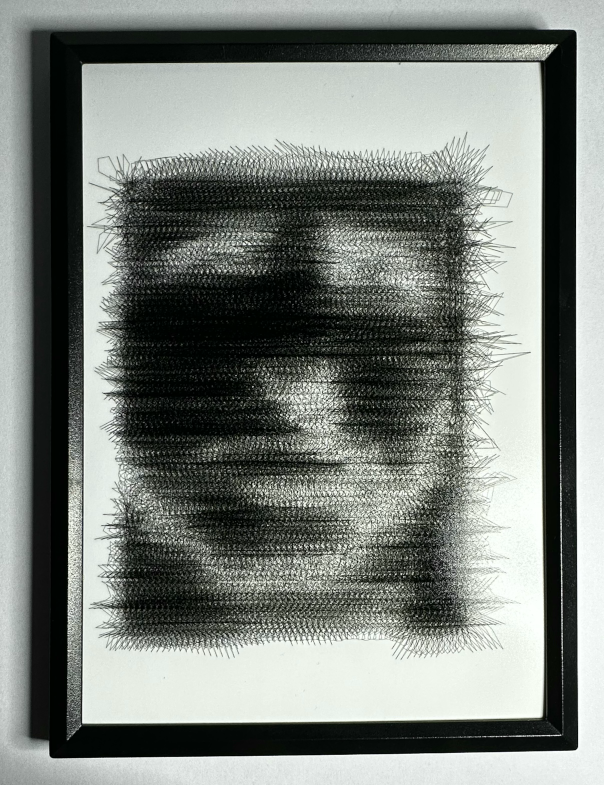
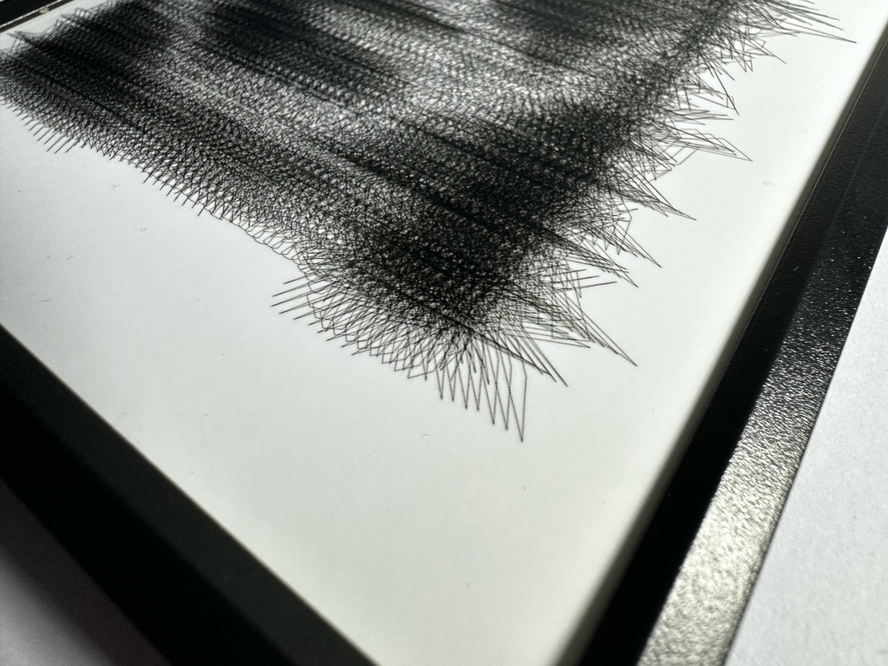
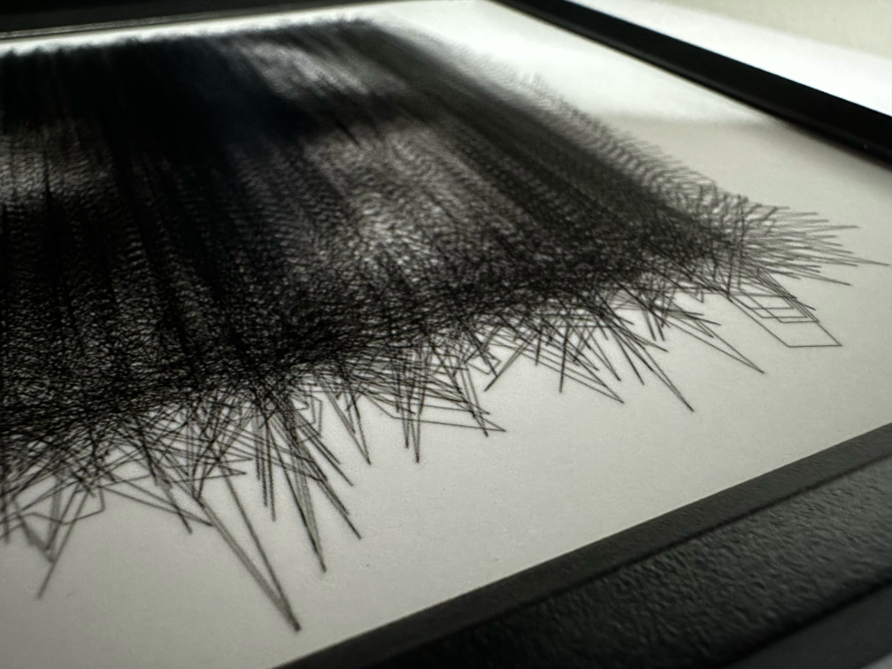
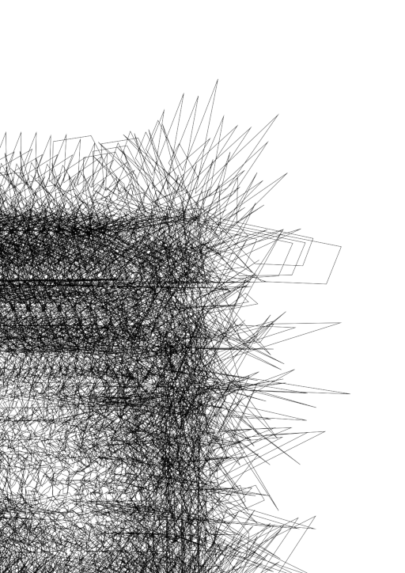

# Self Portrait

### Creating art from the randomness of self.

The ‘Self Portrait’ project uses image subjects to generate a random noise that leads to a final artwork. By prompting viewers to consider the relationship between subjects and artwork, the project encourages a thoughtful engagement with the piece.

 

The project begins as a digital mirror that utilizes the subject's position and surroundings to create a unique image. This image serves as a set of instructions for a physical artifact. The final artwork is created by layering and repeating a simple pattern resulting in a dense and complex image.

